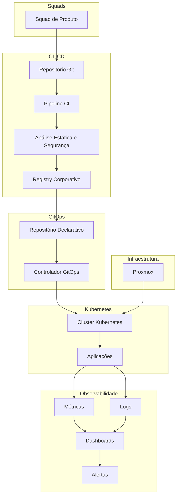
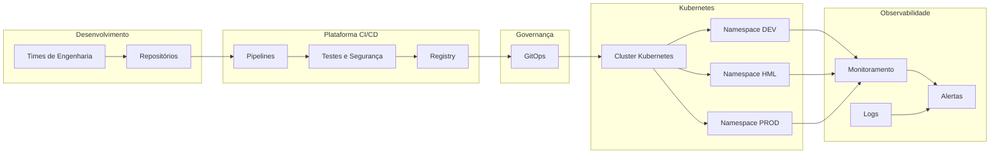

# Diagrama Arquitetural – Visão Conceitual

Este documento descreve a topologia macro da Plataforma DevOps Enterprise Self-Hosted da TechNova Solutions, incluindo fluxo de integração, entrega e observabilidade.

**1. Topologia Geral**

A arquitetura é composta pelos seguintes blocos principais:

- Usuários e Squads de Produto;

- Plataforma de Versionamento e CI;

- Registry Corporativo;

- Plataforma GitOps;

- Cluster Kubernetes;

- Camada de Observabilidade;

- Infraestrutura Virtualizada.

> A comunicação entre esses blocos é controlada e rastreável.

**2. Fluxo de Desenvolvimento e Entrega**

Fluxo lógico de deploy da Squad de produtos:
 
- Commit no repositório;  

- Pipeline de CI executa build;  

- Análise estática e varredura de segurança;  

- Publicação da imagem no Registry;  

- Atualização do repositório declarativo (GitOps);  

- Sincronização automática com o cluster Kubernetes;  

- Implantação controlada no ambiente correspondente.  

Características:

- Todo deploy é rastreável;

- Nenhuma alteração manual em produção;

- Estado desejado mantido de forma declarativa;

- Histórico completo de mudanças.

**3. Fluxo de Observabilidade**

Fluxo de monitoramento e Logs das aplicações no Kubernetes:

- Exportação de métricas;

- Coleta centralizada;  

- Consolidação em dashboards;  

- Avaliação de SLO;  

- Geração de alertas por severidade.  
  
- Coletor de logs;  

- Armazenamento centralizado;  

- Consulta via interface unificada.  

**4. Fluxo de Incidente (Exemplo)**

Cenário: Falha de nó de worker.

- Nó deixa de responder;

- Sistema de monitoramento detecta indisponibilidade;

- Alerta é disparado;

- Kubernetes reprovisiona os pods afetados;

- SLO é impactado temporariamente;

- Incidente é registrado e analisado.

Resultado esperado:

- Baixo MTTR;

- Nenhuma intervenção manual necessária para restauração básica;

- Rastreamento completo do evento.

**5. Separação por Domínio**

A arquitetura está organizada em domínios independentes:

- Infraestrutura;

- Orquestração;

- Integração Contínua;

- Entrega Contínua;

- Observabilidade;

- Governança.

> Cada domínio possui ciclo de vida próprio e versionamento independente.

**6. Princípio de Isolamento**

- Ambientes segregados logicamente;

- Separação de namespaces;

- Controle de acesso baseado em papéis;

- Políticas de rede para reduzir superfície de ataque.

## Representação Visual

## Visão Arquitetural – Nível Executivo

