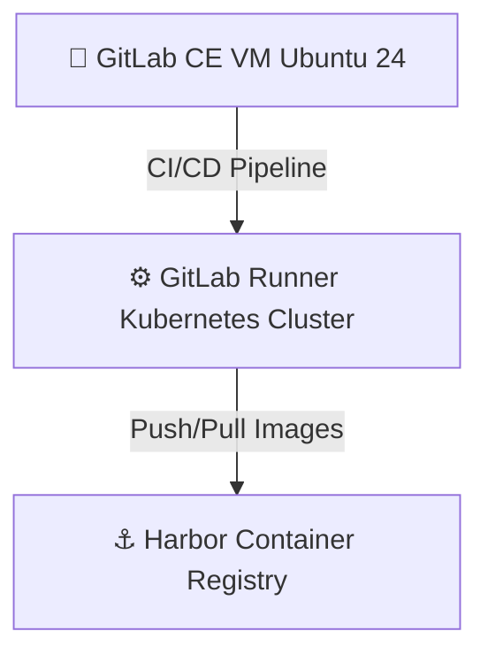

# GitLab CE – Self Hosted DevOps Enterprise Architecture

## Visão Geral

Este diretório contém a instalação e configuração do GitLab CE em uma VM Ubuntu 24,
integrado a um cluster Kubernetes através do GitLab Runner.

A arquitetura foi projetada seguindo boas práticas enterprise, separando:

- Camada de CI (GitLab CE) em VM dedicada;
- Camada de execução de pipelines (Runner) dentro do cluster Kubernetes;
- Registry corporativo (Harbor).

---

## Arquitetura



---

## Pré-requisitos

- VM Ubuntu 24 criada no Proxmox;
- DNS ou /etc/hosts configurado;
- Cluster Kubernetes funcional;
- Harbor instalado e validado.

---

## Instalação do GitLab CE

1 - Atualize o sistema:

```bash
sudo apt update && sudo apt upgrade -y
```

2 - Execute o script de instalação:

```bash
chmod +x install-gitlab.sh
./install-gitlab.sh
```

3 - Configure o arquivo /etc/hosts (se necessário):

```bash
<IP_DA_VM> gitlab.local
```

4 - Acesse pelo navegador:

http://gitlab.local

Defina a senha do usuário root e finalize a configuração inicial.

---

## Instalação do GitLab Runner no Kubernetes

1 - Configurar o CoreDNS do Kubernetes:

```bash
kubectl edit configmap coredns -n kube-system

#Adicione o bloco `hosts` dentro do `Corefile`:
hosts {
    IP_VM gitlab.local
    IP_WORKER_NODE harbor.local
    fallthrough
}

# Reincie o CoreDNS
kubectl rollout restart deployment/coredns -n kube-system
kubectl get pods -n kube-system | grep -i core
```

2 - Adicionar repositório Helm:

```bash
helm repo add gitlab https://charts.gitlab.io
helm repo update
```

3 - Criar namespace:

```bash
kubectl create namespace gitlab-runner
```

4 - Instalar Runner:
  Será necessário obter o TOKEN de registro no Gitlab-CI, caminho: Settings → CI/CD → Runners → Expand → Registration Token  

```bash
helm install gitlab-runner gitlab/gitlab-runner \
  --namespace gitlab-runner \
  --set gitlabUrl=http://gitlab.local \
  --set runnerRegistrationToken=<TOKEN> \
  --set rbac.create=true \
  --set serviceAccount.create=true \
  --set runners.privileged=true
```

5 - Verificar se o Runner foi registrado no Gitlab-CI:

```bash
kubectl logs -n gitlab-runner -l app=gitlab-runner -f
```

### Validação:

Criar um projeto de teste e adicionar .gitlab-ci.yml:

```yaml
stages:
  - test

test-runner:
  stage: test
  script:
    - echo "Runner funcionando!"
```

Executar pipeline e validar se o job roda no Runner do Kubernetes.

## Integração com Harbor

No pipeline, configurar login:

```bash
docker login harbor.local -u <USER> -p <PASSWORD>
docker push harbor.local/project/app:latest
```

Recomenda-se utilizar variáveis protegidas no GitLab CI.

### Estrutura do Diretório

infra/gitlab/
├── install-gitlab.sh
├── README.md
└── ADR-0003-gitlab-architecture.md

### Objetivo Arquitetural

Demonstrar:

- Separação de responsabilidades;

- Automação via script Bash;

- Integração CI/CD real com Kubernetes;

- Registry privado corporativo (Harbor);

- Documentação arquitetural via ADR.
