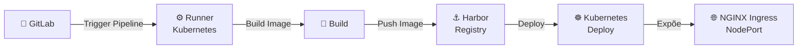

# ADR-0004 – Estratégia de Organização de Cluster

## Status

Aceito

## Contexto

O cluster Kubernetes foi projetado para suportar uma arquitetura DevOps empresarial autohospedada.

**Características atuais do cluster:**

- Cluster multi-nó (1 plano de controle + 1 nó de trabalho);

- Controlador de entrada NGINX instalado;

- Exposição via NodePort (ambiente bare metal);

- Provisionador de caminho local para armazenamento dinâmico;

- GitLab Runner implantado dentro do cluster;

- Harbor usado como registro de contêineres privado.

O projeto requer uma organização estruturada, escalável e semelhante à de produção de cargas de trabalho e componentes de infraestrutura.

---

## Decisão

O cluster será organizado logicamente usando segmentação de namespace com base em domínios de responsabilidade.

**Namespaces definidos:**

- infra → Cargas de trabalho relacionadas à infraestrutura;

- apps → Aplicativos de negócios/cargas de trabalho;

- monitoring → Pilha de observabilidade (implementação futura).

**Estratégia de entrada:**

- NGINX Ingress Controller como ponto de entrada HTTP/HTTPS padrão;

- NodePort usado como mecanismo de exposição externa (cenário bare metal).

**Estratégia de armazenamento:**

- Provisionador de caminho local para cargas de trabalho de desenvolvimento/laboratório;

- PersistentVolumeClaims necessários para componentes com estado.

**Estratégia de RBAC:**

- Isolamento em nível de namespace;

- Princípio do menor privilégio;

- ServiceAccounts por aplicativo (aprimoramento futuro).

---

## Justificativa

1. A segmentação de namespaces melhora o isolamento e a governança;

2. A configuração com vários nós permite a separação entre o plano de controle e as cargas de trabalho;

3. O NGINX Ingress é amplamente adotado e comprovado em produção;

4. O NodePort é adequado para ambientes de laboratório bare metal sem LoadBalancer;

5. O armazenamento de caminho local é leve e suficiente para ambientes que não sejam de produção;

6. A arquitetura espelha ambientes empresariais reais dentro das restrições de laboratório.

---

## Consequências

### Positivas

- Separação clara de responsabilidades;

- Melhor legibilidade e manutenção do cluster;

- Expansão futura facilitada (monitoramento, segurança, GitOps);

- Base pronta para implantações automatizadas de CI/CD.

### Negativas

- A exposição do NodePort requer gerenciamento manual de portas;

- O armazenamento em local-path não é adequado para cenários de alta disponibilidade em produção;

- Alta disponibilidade limitada devido ao pequeno tamanho do cluster.

---

## Melhorias Futuras

- Substituir o NodePort pelo MetalLB para suporte a balanceadores de carga;

- Introduzir NetworkPolicies;

- Implementar um backend de armazenamento dedicado (NFS ou armazenamento distribuído);

- Adotar GitOps (ArgoCD ou Flux);

- Implementar uma pilha completa de observabilidade.

---

## Fluxo da Arquitetura

---

Autor: Robson Ferreira  
Projeto: arquitetura empresarial Devops autohospedada