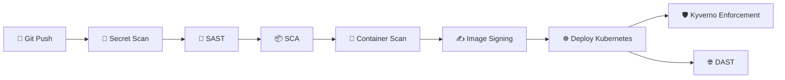

# ADR-0006 – DevSecOps Strategy

## Status

Aceito

---

## Contexto

A arquitetura DevOps autohospedada evoluiu para um estágio onde apenas automação de build e deploy não é suficiente.

O aumento de ataques de Supply Chain, vazamento de credenciais e exploração de vulnerabilidades em dependências exige a incorporação de segurança diretamente no pipeline de CI/CD e no cluster Kubernetes.

Cenário atual da arquitetura:

- GitLab CI como orquestrador de pipeline;

- Build de imagens containerizadas;

- Registry privado Harbor;

- Deploy automatizado via Helm;

- Cluster Kubernetes bare metal;

- Separação entre infraestrutura e workloads.

A arquitetura necessita evoluir para um modelo de DevSecOps enterprise, incorporando segurança contínua e automatizada.

---

## Decisão

A segurança será implementada de forma integrada ao pipeline e ao cluster, adotando uma estratégia de múltiplas camadas:

**Segurança no Pipeline (Shift-Left):**

- Secret Scanning com Gitleaks;

- SAST com Semgrep;

- SCA com Trivy (filesystem);

- Container Image Scan com Trivy (image mode);

- Bloqueio automático para vulnerabilidades HIGH e CRITICAL;

- Assinatura obrigatória de imagens com Cosign.

**Segurança em Runtime (Cluster):**

- Policy as Code com Kyverno;

- Bloqueio da tag latest;

- Obrigatoriedade de resource limits;

- Execução obrigatória como non-root;

- Verificação de assinatura de imagem.

**Princípios Operacionais:**

- Fail Fast;

- Automação total da segurança;

- Segurança como código;

- Integração direta com CI/CD;

- Defesa em profundidade.

---

## Justificativa

1 - Segurança deve ser aplicada antes do deploy (Shift-Left);

2 - Vulnerabilidades críticas não podem chegar ao ambiente Kubernetes;

3 - Assinatura de imagens garante integridade e origem confiável;

4 - Policy as Code evita que configurações inseguras sejam implantadas;

5 - A automação elimina dependência de validação manual;

6 - A arquitetura passa a refletir práticas reais de ambientes corporativos modernos.

## Consequências

---

### Positivas

- Pipeline com bloqueio automático de riscos críticos;

- Redução significativa de exposição a CVEs;

- Garantia de integridade de imagens;

- Aumento da rastreabilidade e compliance;

- Arquitetura compatível com padrões modernos de Supply Chain Security.

---

### Negativas

- Aumento do tempo total de pipeline;

- Necessidade de manutenção contínua das regras de segurança;

- Possível bloqueio frequente em ambientes com dependências desatualizadas;

- Complexidade operacional maior em comparação a pipeline tradicional.

---

## Melhorias Futuras

- Geração automática de SBOM;

- Implementação de attestation (provenance);

- Adoção de SLSA Level 3+;

- Integração com Transparency Log (Rekor);

- Runtime Security com Falco;

- Integração com GitOps e políticas centralizadas.

## Fluxo da Arquitetura

---

Autor: Robson Ferreira
Projeto: self-hosted-devops-enterprise-architecture