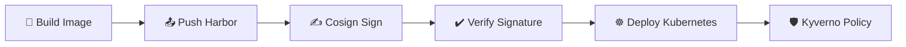

# ADR-0007 – Container Image Signing Strategy

## Status

Aceito

---

## Contexto

Imagens de container representam o artefato final entregue ao cluster Kubernetes.

Sem um mecanismo de verificação de integridade, o cluster pode executar:

- Imagens adulteradas;

- Imagens não autorizadas;

- Artefatos substituídos no registry;

- Builds não rastreáveis.

O ambiente utiliza:

- GitLab CI para build;

- Harbor como registry privado;

- Kubernetes para execução;

- Helm como mecanismo de deploy.

É necessário garantir que apenas imagens legítimas, produzidas pelo pipeline oficial, sejam executadas.

---

## Decisão

Adotar assinatura criptográfica obrigatória de imagens utilizando Cosign (Sigstore).

Estratégia definida:

- A imagem é assinada imediatamente após o build;

- A chave privada é armazenada como variável protegida no CI;

- A chave pública é utilizada para verificação;

- O deploy somente ocorre após verificação bem-sucedida;

- O cluster exige imagens assinadas via política Kyverno.

Fluxo de assinatura:

- Build da imagem;

- Push para Harbor;

- Assinatura com Cosign;

- Verificação no pipeline;

- Deploy autorizado;

- Enforcement adicional no cluster.

---

## Justificativa

- Garante integridade do artefato;

- Impede execução de imagens externas ou não autorizadas;

- Protege contra ataques de Supply Chain;

- Aumenta rastreabilidade do build;

- Alinha a arquitetura com padrões modernos de segurança;

- Cria base para futuras implementações de attestation.

---

## Consequências

**Positivas**

- Garantia de origem confiável das imagens;

- Bloqueio automático de artefatos não assinados;

- Segurança adicional mesmo que o registry seja comprometido;

- Base para compliance e auditoria.

**Negativas**

- Gerenciamento adicional de chaves criptográficas;

- Complexidade maior no pipeline;

- Dependência de boas práticas de proteção de variáveis no CI;

- Possível falha de deploy caso verificação não esteja corretamente configurada.

---

## Melhorias Futuras

- Migração para keyless signing (Fulcio);

- Integração com Rekor Transparency Log;

- Implementação de attestation com SBOM;

- Automação de rotação de chaves;

- Integração com SLSA framework.

---

## Fluxo da Arquitetura

---

Autor: Robson Ferreira
Projeto: self-hosted-devops-enterprise-architecture